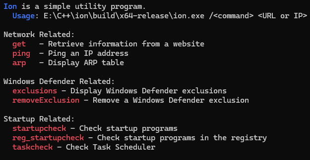

# Ion
 - A simple utility program to check basic locations for payloads to drop at.

## 3 Network Utilities
 - get - Retrieve information from a website 
 - ping - Ping an IP Address/host
 - arp - Display current machines ARP table 

## 3 Windows Defender Utilities
 - exclusions - Mostly used to ignore flagged payloads, or just entirely ignore a drive.
 - removeExclusionPath - Remove a Path 
 - removeExclusionExtension - Remove a Extension Excluded.

## 3 Checks for Startup Programs
 - startupCheck - Check startup Folder for Programs.
 - reg_startupCheck - Check startup programs in the registry
 - taskcheck - Check Tash Scheduler.

